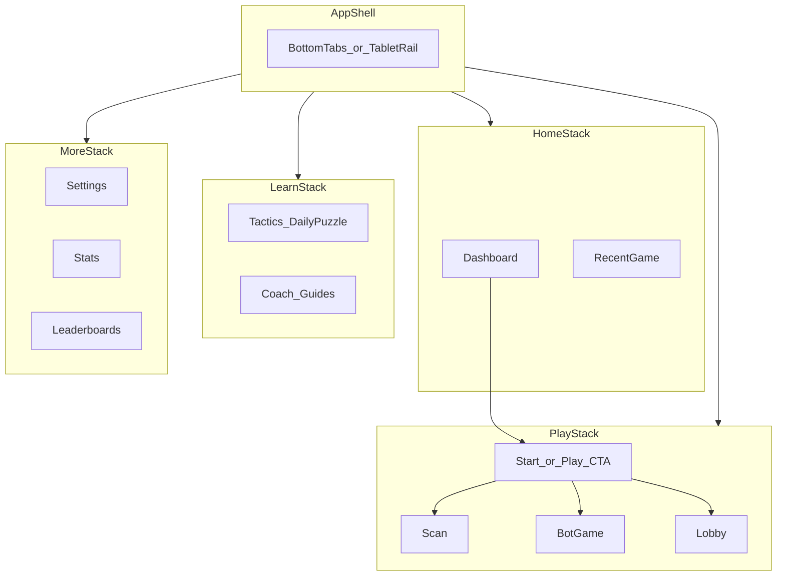

# BoardSight — UI / UX plan and checklist

**Last updated:** 2026-04-27  
**Related:** [docs/feature_adds.md](../docs/feature_adds.md) (feature backlog)  
**Inspiration:** Chess.com-style *patterns* (dark dashboard, cards, bottom nav, strong Play CTA). **Do not** copy their logos, art, or trademarks — original icons and name only.

**Reference images (internal):** use session/workspace assets as mood reference only.

---

## 1) Goals

- [ ] **Phone:** One-hand friendly, scrollable home; clear primary action (Play); readable typography.
- [ ] **iPad:** Use width — grids, optional side navigation / split layouts; no wasted horizontal space.
- [ ] **Consistent** with existing theme system: [BoardSight/src/ui/theme.ts](../BoardSight/src/ui/theme.ts) (extend tokens rather than ad-hoc colors).

---

## 2) Design principles

- [ ] **Dark-first** card UI: page background + elevated `bgCard` sections.
- [ ] **Hierarchy:** section title + optional “View all”; primary CTA visible without hunting.
- [ ] **Touch:** minimum ~44pt targets; list rows tall enough to tap.
- [ ] **Motion:** keep subtle; prefer clarity over animation.

---

## 3) Responsive layout (phone vs iPad)

**Breakpoints (suggested, tune in code):**

- [ ] **Compact** (typical phone portrait): single column; horizontal `ScrollView` for “quick action” cards.
- [ ] **Medium** (large phone / small tablet): 2-column grid for stat/quick-action cards where it helps.
- [ ] **Wide** (e.g. iPad, width ≥ 900): 2–3 column dashboard; consider **navigation rail** or **master–detail** for Library / Stats / Game review.

**Implementation notes (later):**

- [ ] Use `useWindowDimensions()`; avoid hardcoding only iPhone sizes.
- [ ] Respect safe areas and orientation changes.

---

## 4) Visual language (tokens)

- [x] **Theme hook** exists: `useTheme()` / `ColorPalette` in `theme.ts`.
- [x] **Optional “Chess.com-like” CTA** — add a dedicated token (e.g. `accentCta` / green) for primary buttons *without* breaking existing `accent` usage — audit screens after adding.
- [ ] **Card radius** standardized (e.g. 12–16) across new dashboard components.
- [ ] **Section spacing:** consistent vertical rhythm (e.g. 8/16/24).

---

## 5) App shell and navigation

- [x] **Stack navigator** in place: [src/ui/navigation/index.tsx](../BoardSight/src/ui/navigation/index.tsx).
- [ ] **Bottom tab bar (Chess.com–style shell)** for core areas: e.g. Home, Puzzles/Drills, **Play** (center), Learn, More — stack screens nest inside each tab.
- [ ] **Tablet:** optional left **rail** instead of or in addition to bottom tabs.
- [ ] **Badges** (e.g. More): only if product needs notifications — placeholder pattern.

---

## 6) Home / dashboard (screen)

- [ ] **Top bar:** app identity + user/status area (streak, settings — product-dependent).
- [ ] **Recent activity / last game** row: opponent placeholder, rematch CTA, link to review.
- [ ] **Quick actions** row: horizontal cards (e.g. Scan board, vs Bot, Multiplayer, Library).
- [ ] **Stats summary** row: small metric cards (W/L, puzzle rating, etc. — as data allows).
- [ ] **Game history** list: row pattern with result + optional accuracy column.
- [ ] **Primary “Play” CTA** full-width above tab bar (or fixed footer region).

---

## 7) Features from `feature_adds.md`

### 7.1 Rapid / time-based games (3, 5, 10, custom) — bot + human

- [x] **Clock presets** exist in domain: [src/domain/gamecore/clock.ts](../BoardSight/src/domain/gamecore/clock.ts) (includes 3+2, 5+0, 10+0, etc.).
- [x] **UI presents** clear **3 / 5 / 10 min** (and increment policy per product) + **custom** minutes/seconds in [TimeControlPicker](../BoardSight/src/ui/components/TimeControlPicker.tsx) / start flows.
- [ ] **vs Bot** path: from Home + Start flow — time control passed into session.
- [ ] **vs Person** path: Lobby / P2P / cloud — same time-control picker; show latency/consent UI where needed.

### 7.2 Daily puzzle

- [ ] **Entry** from Home and/or Puzzles tab.
- [ ] **Solve flow** reuses Tactics/Drill patterns where possible ([TacticsScreen](../BoardSight/src/ui/screens/TacticsScreen.tsx) / [DrillScreen](../BoardSight/src/ui/screens/DrillScreen.tsx)).
- [ ] **Streak / completion** state (if product wants) — local + optional sync.

### 7.3 Learning coach and guides

- [ ] **Coach entry** (Learn tab or Home card): short tips, links to drills and library.
- [ ] **Empty states** that teach: first-time Scan, first-time multiplayer.

### 7.4 Leaderboards

- [ ] **UI shell** (tabs: Global / Friends / Local) — **blocked on backend + auth**; define placeholder.
- [ ] **Empty and loading** states.

### 7.5 Statistic boards

- [ ] **Profile / Stats** screen: key metrics (games, accuracy, time played).
- [ ] **Tie-in** to post-game review when analysis exists ([ReviewScreen](../BoardSight/src/ui/screens/ReviewScreen.tsx)).
- [ ] **Library** enhancements: filter/sort, win rate — align with [LibraryScreen](../BoardSight/src/ui/screens/LibraryScreen.tsx).

### 7.6 “UI dev steals from chess.com” (ethical / legal)

- [ ] **Patterns only** (card dashboard, bottom nav, green CTA): OK to emulate.
- [ ] **No** reuse of their artwork, exact layout clones, or trademarked branding.

---

## 8) QA — devices and checks

- [ ] **iPhone** small + large; **iPad** portrait + landscape; **Android** one phone + one tablet if available.
- [ ] **Update snapshots** for shared components when layout changes ([BoardSight/__tests__/ui](../BoardSight/__tests__/ui/)).
- [ ] **Accessibility:** Dynamic Type / font scaling sanity; contrast on `textMuted`.

---

## 9) Phased delivery (suggested)

| Phase | Focus |
|-------|--------|
| A | Tokens + card/section primitives + breakpoints helper |
| B | Tab shell + Home dashboard (static/placeholder data) + Play CTA |
| C | Time control UX (3/5/10/custom) wired through Bot + MP |
| D | Daily puzzle + Learn coach surfaces |
| E | Stats page + leaderboard placeholders + iPad layout pass |

**Phase A** — [ ] not started / **B** — [ ] / **C** — [ ] / **D** — [ ] / **E** — [ ]

---

## 10) Open questions (product)

- [ ] **Accounts:** required for leaderboards and cloud stats, or guest-first?
- [ ] **Monetization / premium** — affects top bar (e.g. diamond) — out of scope unless you say otherwise.

---

## 11) Information architecture (target)

## 12) Code touchpoints (implementation)

| Area | Path |
|------|------|
| Theme | [../BoardSight/src/ui/theme.ts](../BoardSight/src/ui/theme.ts) |
| Navigation | [../BoardSight/src/ui/navigation/index.tsx](../BoardSight/src/ui/navigation/index.tsx) |
| Start / modes | [../BoardSight/src/ui/screens/StartGameScreen.tsx](../BoardSight/src/ui/screens/StartGameScreen.tsx) |
| Time controls UI | [../BoardSight/src/ui/components/TimeControlPicker.tsx](../BoardSight/src/ui/components/TimeControlPicker.tsx) |
| Domain clock | [../BoardSight/src/domain/gamecore/clock.ts](../BoardSight/src/domain/gamecore/clock.ts) |
